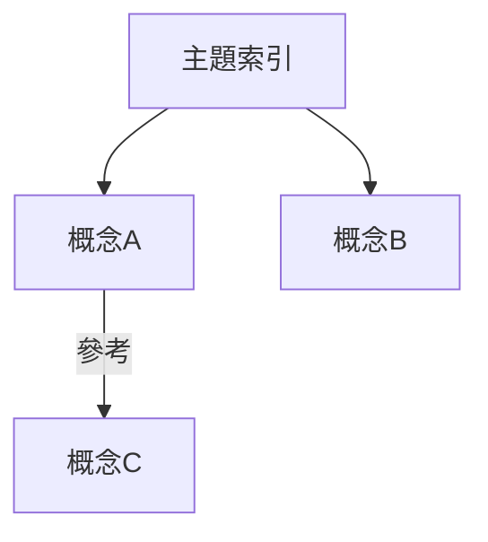

# 關係類型 Schema

定義 Obsidian vault 中筆記之間的語意關係，以及解析方式。

---

## Frontmatter 關係欄位

以下為**範例欄位**。實際使用的欄位由 `vault-config.md` 中的 `RELATIONSHIP_FIELDS` 設定決定。

### 範例：Zettelkasten 風格

| 欄位 | 語意 | 方向 | 範例 |
|------|------|------|------|
| `Up` | 上層主題 / 父概念 | 子 → 父 | `Up: [[主題索引]]` |
| `來源` | 知識來源 / 出處 | 筆記 → 文獻 | `來源: [[某本書]]` |
| `參考` | 參考資料 / 相關概念 | 筆記 ↔ 筆記 | `參考: [[相關概念]]` |
| `應用於` | 應用場景 / 實踐 | 知識 → 場景 | `應用於: [[專案筆記]]` |
| `衍生自` | 衍生來源 / 前身 | 新 → 舊 | `衍生自: [[原始想法]]` |

### 範例：生醫知識庫

| 欄位 | 語意 | 方向 | 範例 |
|------|------|------|------|
| `company` | 製造商/公司 | 產品 → 公司 | `company: [[Medtronic]]` |
| `materials` | 材料/成分 | 產品 → 材料 | `materials: [[Titanium alloy]]` |
| `indications` | 適應症 | 產品 → 症狀 | `indications: [[Spinal fusion]]` |
| `related_genes` | 相關基因 | 疾病 → 基因 | `related_genes: [[BRCA1]]` |

### 自定義欄位

在 `vault-config.md` 的 `關係欄位` 區段設定你的 vault 使用的 frontmatter 欄位：

```json
["Up", "來源", "參考", "應用於", "衍生自"]
```

規則：
- 陣列中的每個字串對應你筆記 frontmatter 中的一個欄位名
- frontmatter-relations 查詢會讀取這些欄位的值
- 欄位值可以是 `[[wikilink]]` 或純文字

### 欄位格式

```yaml
# 單值
Up: "[[主題索引]]"

# 多值（YAML list）
參考:
  - "[[概念A]]"
  - "[[概念B]]"

# 純文字（無 wikilink）
來源: "某作者的演講"
```

### 解析邏輯

frontmatter-relations 模板自動處理：
1. 單值 → 轉為陣列
2. `[[wikilink]]` → 提取連結目標
3. 純文字 → 保留原值（標記為非連結）

---

## Inline Dataview 欄位

部分筆記使用 Dataview 的 inline field 語法標註關係：

```markdown
筆記內容中會出現：
[Up:: [[主題索引]]]
[來源:: [[某本書]]]
[參考:: [[概念A]]]
```

### 解析正則

```
\[(\w+)::\s*\[\[([^\]]+)\]\]\]
```

- 群組 1：欄位名
- 群組 2：連結目標

### 注意事項

- Inline field 需要讀取筆記內容才能解析（用 `read` 指令）
- 比 frontmatter 慢，但有些用戶偏好 inline 標註
- 同一筆記可能同時有 frontmatter 和 inline field

---

## 無標註連結（推理關係）

當兩篇筆記之間有連結但沒有任何語意標註時，可以透過 LLM 推理關係類型。

### 推理所需資料

1. **兩端筆記的前 500 字**（用 `read` 指令取得）
2. **共同 frontmatter 屬性**（用 `properties` 指令比對）
3. **連結方向**（A→B 或 B→A 或雙向）
4. **連結上下文**（連結在句子中的位置和前後文）

### 推理 Prompt 模板

```
以下兩篇筆記之間有連結關係，請判斷最可能的關係類型：

筆記 A: {title_a}
---
{content_a_first_500}
---

筆記 B: {title_b}
---
{content_b_first_500}
---

連結方向: {A→B / B→A / 雙向}

可能的關係類型：
1. 上下位（父子概念）
2. 來源引用（知識出處）
3. 相互參考（平行概念）
4. 應用關係（理論→實踐）
5. 衍生關係（舊→新）
6. 其他（請描述）

請回答：
- 關係類型（編號）
- 關係方向（A→B 或 B→A）
- 信心程度（高/中/低）
- 簡短理由
```

---

## 解析優先順序

效率由高到低：

| 優先順序 | 方法 | 速度 | 資料來源 | 何時使用 |
|----------|------|------|----------|----------|
| 1 | Frontmatter 欄位 | 快 | `metadataCache` | 永遠先查 |
| 2 | Inline Dataview | 中 | 讀取筆記內容 | frontmatter 無標註時 |
| 3 | LLM 推理 | 慢 | 讀取兩端筆記 | 完全無標註的連結 |

### 標記慣例

輸出時必須標明資料來源：

```markdown
| 關係 | 類型 | 來源 |
|------|------|------|
| A → B | Up（上層主題） | ✅ frontmatter |
| A → C | 參考（相關概念） | ✅ inline field |
| A → D | 應用（理論→實踐） | 🤖 LLM 推理（信心: 中） |
```

---

## 關係圖可視化建議

當用戶要求「畫出關係圖」時，用 ASCII 或 Mermaid 呈現：

### 小範圍（≤10 節點）：ASCII

```
          ┌──────────┐
          │ 主題索引  │
          └────┬─────┘
               │ Up
        ┌──────┴──────┐
   ┌────┴───┐    ┌────┴───┐
   │ 概念 A │    │ 概念 B │
   └────┬───┘    └────────┘
        │ 參考
   ┌────┴───┐
   │ 概念 C │
   └────────┘
```

### 大範圍（>10 節點）：Mermaid


